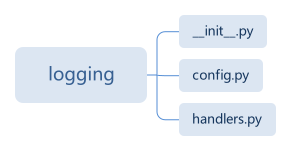
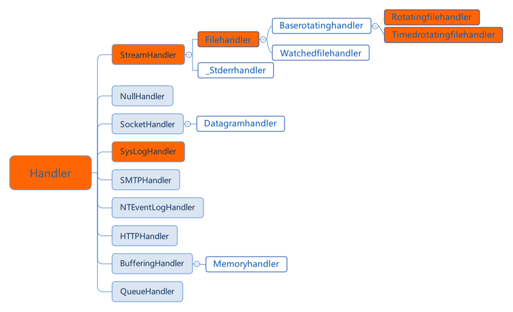

# python-logging-demo

logging is a built-in package in Python. There are only **Three** files in this package.



1. __init__.py
2. config.py
3. handlers.py



The logging library takes a modular approach and offers several categories of components: loggers, handlers, filters, and formatters.

* Loggers expose the interface that application code directly uses.
* Handlers send the log records (created by loggers) to the appropriate destination.
* Filters provide a finer grained facility for determining which log records to output.
* Formatters specify the layout of log records in the final output.


A good convention to use when naming loggers is to use a module-level logger, in each module which uses logging, named as follows:

```
logger = logging.getLogger(__name__)
```

# Logging from multiple modules